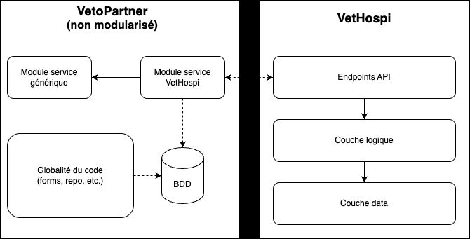

# 🧩 Intégrer l'ancien et le moderne : VetHospi ↔ VetoPartner

## 🎯 Problématique

**Comment intégrer des solutions SaaS développées sur des architectures modernesavec des progiciels existants "legacy" ?**

Ce projet explore l'intégration entre **VetHospi** (application web moderne) et **VetoPartner** (progiciel legacy développé en Delphi il y a plus de 20 ans), dans un contexte réel de logiciel métier pour cliniques vétérinaires.

---

## 🧭 Contexte

- **VetHospi** est une application PWA moderne en Angular + Symfony/API Platform, conçue pour gérer les hospitalisations vétérinaires.
- **VetoPartner** est un PMS ancien, monolithique, difficilement maintenable, mais toujours utilisé.

**Pourquoi les connecter ?**
- Pour échanger automatiquement les informations de gestion d’hospitalisation.
- Pour valider l’API VetHospi dans un vrai contexte métier.
- Pour rendre VetHospi plus attractif pour d'autres éditeurs.

---

## 🧱 Les vrais enjeux (au-delà de la technique)

- 🔄 Assurer la **continuité de service** côté legacy sans bug ni régression.
- 🧩 Proposer une **intégration simple** pour les futurs partenaires.
- ⚕️ Respecter les **règles métier** spécifiques aux cliniques vétérinaires.
- 🔧 Limiter les impacts sur un code legacy instable et sensible.

---

## 🗺️ Architecture d’intégration

  
*Un connecteur local interprète les données reçues de VetHospi via API et les injecte proprement dans VetoPartner.*

---

## 🔍 Phase de recherche

Je n'ai pas choisi les technologies : elles étaient en place.  
👉 Mon rôle : **comprendre et interfacer intelligemment**, sans refactoriser tout VetoPartner.

### 🔦 Analyse du code legacy (VetoPartner)

Principaux constats :
- 📂 Aucune structure de packages (fichiers à plat)
- ❌ Requêtes SQL dans les boutons, sans Repository
- 🧱 Modèles mal définis ou absents
- 🧪 Pas d’interface, peu ou pas d’héritage ou de découplage
- 📉 Base de données sans contraintes (PK/foreign keys absentes)
- 🧩 Règles métier dispersées, pas de services centralisés

📸 *Voir captures et extraits de code dans `/screenshots/constats-legacy`*

### 🎯 Objectifs de l’analyse

- Identifier les **zones stables** exploitables
- Définir une **intégration non intrusive**
- **Isoler** les composants pour limiter les risques
- Trouver un **chemin viable** dans une sorte de « jungle technique »

### 💡 Pourquoi c’est crucial

> Dans le legacy, **analyser avant de coder est vital**.  
Chaque ligne de code modifiée peut provoquer des effets de bord.  
Une bonne cartographie du terrain conditionne le succès de l’intégration.

---

## 🛠️ Phase de développement

### 🧱 Création de modèles internes

- Nouvelle base métier propre (avec clés primaires, étrangères, typage cohérent)
- Correspondance avec les entités envoyées par VetHospi
- Mini “ORM local” isolé, intégré sans modifier le cœur de VetoPartner

🎯 **Avantage** : les modèles deviennent un **miroir du flux métier**, facilitant la validation et les ajustements.

### 🌐 Connexion à l’API VetHospi

- Reprise par héritage d’un module HTTP interne déjà présent
- Architecture à 3 couches utilisée :
  - **UI** : configuration (URL, credentials, préférences)
  - **Engine** : logique métier, insertions BDD
  - **Interface** : appels HTTP

🎯 Résultat : intégration fluide, sans recréer toute la stack réseau.

### 🔁 Sérialisation & désérialisation JSON

- JSON géré **manuellement** via méthodes dans les DTO
- Delphi n’offrant pas de sérialisation moderne (automatique), j’ai codé chaque méthode à la main
- Conversion contrôlée avec validation métier intégrée

### 🧰 Réutilisation de modules existants

- Logs
- Préférences / paramètres
- Stockage local des identifiants API

🎯 Moins de bruit technique, plus de robustesse.

### 🚫 Ce que j’aurais aimé faire (mais n’ai pas pu)

- 🔧 Injection de dépendance
- 📦 Ajout de librairies modernes

👥 L’équipe legacy limite les dépendances externes.  
🎯 J’ai donc fait le choix **du pragmatisme**, en gardant un code propre mais minimaliste.

---

## 🧪 Intégration = validation de l’API

Cette intégration a aussi servi à :
- **Valider le flux API VetHospi** en situation réelle
- **Simplifier les payloads** : uniquement les infos utiles
- Préparer l’API à être facilement consommable par d’autres PMS

🎯 VetHospi a évolué grâce à ce retour terrain concret.

---

## 🤝 Une opportunité rare : modifier les deux côtés

Souvent, dans ce type d’intégration :
- L’API est figée
- Le legacy est intouchable

Ici :
- J’ai pu **ajuster l’API VetHospi** si nécessaire
- Et **adapter les modèles d’intégration côté VetoPartner**

🎯 Une situation rare, mais idéale pour faire converger deux logiciels très différents.

---

## 🔮 L'avenir du projet

L'intégration directe du connecteur au sein de **VetoPartner** a été une étape précieuse.  
Elle a permis de :
- ✅ Comprendre le flux de données réel
- ✅ Évaluer l’utilité métier de chaque champ
- ✅ Ajuster l’API VetHospi en fonction des besoins réels

---

### ⚠️ Un frein organisationnel : la gouvernance du legacy

Malgré ces apports, des **désaccords avec l’équipe legacy** ont émergé.

Cette équipe, qui maintient un code qu’elle n’a pas écrit, souhaite **éviter toute modification interne** à VetoPartner.  
Les raisons évoquées :
- Risque d’**effets de bord** sur une base instable
- **Responsabilité technique** en cas d’incident
- Absence de tests de non-régression automatisés

🎯 Une attitude prudente, parfois excessive, mais **compréhensible dans un environnement legacy fragile**.

---

### 🧩 La solution retenue : un connecteur externalisé

Un **compromis pragmatique** a été trouvé :

- Création d’une **application autonome** agissant comme connecteur
- Possibilité de déployer cette app comme un **service Windows**
- Tâches planifiées (ex. synchronisation toutes les X heures)
- Pas de modification du code interne de VetoPartner

🎯 Cela permet d’**intégrer sans intrusivité** en intéragissant uniquement avec quelques rares tables de VetoPartner, tout en respectant les contraintes imposées.

---

### 🤝 Travailler entre équipes aux visions différentes

Ce projet illustre une réalité fréquente :  
Deux mondes doivent collaborer :
- 🧱 L’équipe **legacy**, conservatrice, garante de la stabilité
- 🚀 L’équipe **moderne**, orientée innovation, interopérabilité et ouverture

#### Clés pour bien travailler ensemble :
- 👂 Écouter et comprendre les peurs liées au legacy
- 📐 Proposer des solutions **progressives et isolées**
- ⚖️ Trouver un **équilibre sain** entre risque et avancement

> Ce projet démontre qu’**on peut faire avancer une intégration technique**, même dans un contexte humain et technique contraint.

## 📂 Contenu partagé

- `/json/` : exemples de payloads API VetHospi  
- `/examples/` : extraits de code du connecteur  
- `/screenshots/` : captures illustrant les différents modules  
- `/demo/` : vidéos de démonstrations du flux entre le connecteur Vetopartner et VetHospi

---

## 📌 À retenir

> Intégrer une solution SaaS moderne dans un progiciel legacy, ce n’est pas juste du code.  
C’est une question de **stratégie, de respect du contexte existant**, et de compromis techniques bien choisis.

---

## 👤 Auteur

**Adrien Lambert** – Étudiant M1 Expert en architecture et développement logiciel - DIIAGE
Alternance chez **Aldaria**

---